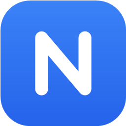
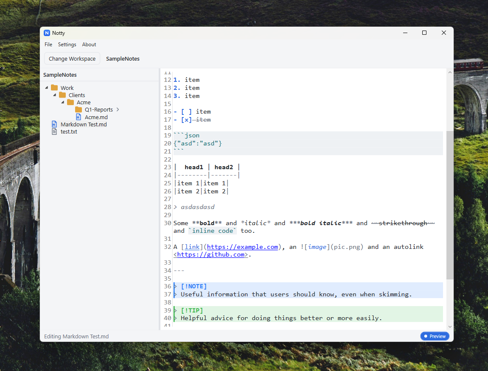

<p align="center">
  
</p>

<h1 align="center">Notty</h1>

<p align="center">
  A file-based notes manager for Windows — <em>your folders are the database.</em>
</p>

<p align="center">
  <strong>Windows 10/11 · .NET 8 · WPF · MVVM</strong>
</p>

---

## Why Notty

Notty manages plain‑text and Markdown notes the simplest way possible: as **ordinary files on disk**.

- **Notes are files** — `.md` and `.txt`, nothing else.
- **Categories are folders** — the filesystem *is* the hierarchy.
- **No database, no cloud, no account, no lock‑in.** Close the app, open the folder in Explorer, and everything is right there.
- **Fully offline**, lightweight, no browser runtime.

A workspace is just a folder you pick. Notty scans it and builds the tree.

```text
Notes/
├─ Work/
│  ├─ Meeting Notes.md
│  └─ Sprint Plan.md
├─ Personal/
│  ├─ Journal.md
│  └─ Shopping List.txt
└─ Learning/
   └─ Networking.md
```
---

## Preview



---

## Features

### Workspace & files
- Open or create a workspace (any folder); the choice is remembered between launches.
- Folder tree with expand/collapse, breadcrumbs, and a depth cap — deeper folders become **"doors"** that re‑root the tree when clicked.
- Right‑click to create Markdown/text documents and categories, **rename**, **duplicate**, **delete** (to the Recycle Bin), and **reveal in Explorer**.
- Optionally show unsupported file types in the tree (with a neutral "?" icon).
- Recent‑documents tracking (most recent 20).

### Editor
- Fast code editor powered by **AvalonEdit**: word wrap, line numbers, configurable tab width, current‑line highlight, font family/size.
- **Smart Markdown list editing** — `Enter` continues a list (and renumbers the next ordered item), `Enter` on an empty item outdents or exits the list, `Tab`/`Shift+Tab` indent/outdent the item.
- **Slash commands** — type `/` to insert elements. The menu adapts to the file type (Markdown vs. plain text). Interactive commands prompt for input (table size, image picker).
- Quality‑of‑life cursor moves — `Down` on the last line jumps to end‑of‑line; `Up` on the first line jumps to start‑of‑line.

### Markdown preview (inline & editable)
Toggle **Preview** in the status bar to render formatting *in place* while keeping the text fully editable. Supports a broad slice of GitHub‑Flavored Markdown:

- Headings, **bold**, *italic*, ***bold‑italic***, ~~strikethrough~~, `inline code`
- Bulleted / numbered / task lists, blockquotes, tables, horizontal rules
- Links, images, autolinks
- Fenced code blocks with a full‑width background
- **GitHub alerts** — `> [!NOTE]`, `> [!TIP]`, `> [!IMPORTANT]`, `> [!WARNING]`, `> [!CAUTION]` rendered as colored callout boxes

### Saving
- **Auto‑save** (optional, on by default) writes changes ~500 ms after you stop typing.
- Manual save with **Ctrl+S**; changes are always flushed when switching files or closing.
- Live save indicator in the status bar: *Unsaved changes → Saving… → Saved just now / 2 mins ago*.

### Theming & customization
- Light and Dark themes built in; add your own by dropping a JSON palette into the themes folder (no rebuild).
- Settings UI for theme, fonts, formatting, saving, and file visibility.
- Sidebar icons are swappable SVGs.

---

## Getting started

### Prerequisites
- Windows 10 or 11
- [.NET 8 SDK](https://dotnet.microsoft.com/download/dotnet/8.0)

### Build & run

```bash
# from the repository root
dotnet run --project src/Notty.App
```

Or build a binary:

```bash
dotnet build Notty.sln -c Release
# output: src/Notty.App/bin/Release/net8.0-windows/Notty.App.exe
```

### Run the tests

```bash
dotnet test
```

---

## Usage

1. On first launch, choose **Create New Workspace** (or **Open Existing Workspace**) and pick a folder.
2. Use the tree (or right‑click a folder) to create notes and categories.
3. Select a note to edit it. Type `/` for the insert menu; toggle **Preview** in the status bar for Markdown rendering.

### Keyboard shortcuts

| Shortcut | Action |
|---|---|
| `Ctrl + N` | New Markdown document |
| `Ctrl + Shift + N` | New category |
| `Ctrl + S` | Save now |
| `/` | Open the slash‑command menu (Markdown/text) |
| `Enter` | Continue / exit a Markdown list |
| `Tab` / `Shift + Tab` | Indent / outdent the current list item |
| `Ctrl + Z` / `Ctrl + Y` | Undo / redo |

---

## Configuration

Settings and themes live under `%AppData%\Notty\` — separate from your notes.

- **Settings:** `%AppData%\Notty\settings.json` (workspace path, theme, editor options, recent documents).
- **Themes:** `%AppData%\Notty\Themes\*.json` — `light.json` and `dark.json` are seeded on first run. Drop in another palette to add a theme; it appears in the menu automatically.

A theme palette looks like:

```json
{
  "name": "Solarized",
  "base": "dark",
  "colors": {
    "Accent": "#268BD2",
    "Window": "#002B36",
    "Panel": "#073642",
    "Border": "#0B3A47",
    "Text": "#EEE8D5",
    "MutedText": "#93A1A1",
    "Hover": "#0B3A47",
    "CodeBg": "#073642",
    "CodeText": "#2AA198"
  }
}
```

**Sidebar icons** are SVGs under `src/Notty.App/Assets/Icons/` (`folders/`, `files/`, `ui/`). Replace a file and rebuild to change an icon.

---

## Project structure

```text
Notty/
├─ Notty.sln
├─ src/
│  ├─ Notty.Core/            # Platform-agnostic domain logic (no WPF)
│  │  ├─ Models/             # AppSettings, ThemePalette, WorkspaceNode, RecentDocument
│  │  └─ Services/           # Notes, workspace scanning, settings, themes
│  └─ Notty.App/             # WPF application (MVVM)
│     ├─ ViewModels/         # MainViewModel, EditorViewModel, SettingsViewModel, …
│     ├─ Views/              # SettingsWindow, AboutWindow, InputDialog
│     ├─ Editor/             # Markdown colorizer, renderers, slash commands, list editing
│     ├─ Services/           # Dialogs, theming, shell operations
│     ├─ Themes/             # Control styles
│     └─ Assets/             # Icons + branding
├─ tests/
│  └─ Notty.Core.Tests/      # Unit tests for the core services
└─ docs/                     # Specification & feature list
```

---

## Tech stack

- **Language:** C# (.NET 8)
- **UI:** WPF, MVVM
- **Editor:** [AvalonEdit](https://github.com/icsharpcode/AvalonEdit)
- **SVG rendering:** [SharpVectors](https://github.com/ElinamLLC/SharpVectors)
- **Settings/themes:** JSON on the local filesystem

---

## Roadmap

Planned, not yet implemented:

- Global search across the workspace (file names + contents)
- Find & replace in the current document
- Formatting toolbar and app‑wide zoom (`Ctrl +` / `Ctrl -`)
- Emoji insertion via `:shortcode:` autocomplete
- Inline image embeds in preview mode

See [`docs/Featurelist.md`](docs/Featurelist.md) for the full list.

---

## License

No license has been declared yet. Until one is added, all rights are reserved by the author.
